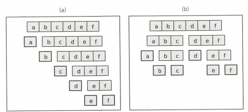

sources : [

-  [프로그래밍 대회에서 배우는 알고리즘 문제해결전략.pdf](../../assets/books/프로그래밍 대회에서 배우는 알고리즘 문제해결전략.pdf) 

]

# General

- 주어진 문제를 둘 이상의 부분 문제로 나눈 뒤 각 문제에 대한 답을 재귀 호출을 이용해 계산하고, 각 부분 문제의 답으로부터 전체 문제의 답을 계산하는 방식의 알고리즘

  > 
  >
  > fig. 일반적 재귀 호출과 분할 정복의 차이
  >
  > - 일반적 재귀 호출 : 문제를 한 조각과 나머지로 나눔
  > - 분할 정복 : 문제를 균등한 2 부분으로 나눔

- 분할 정복 알고리즘의 구성 요소
  - 문제를 더 작은 문제로 분할하는 과정
  - 각 작은 문제에 대한 답을 이용해 큰 문제의 답으로 연결하는 과정
  - 더 이상 분할되지 않으면서 바로 해답이 나오는 가장 작은 문제
- 분할 정복 알고리즘 요구사항
  - 문제를 나누는 방법
  - 해답을 합치는 방법

# 예제 : 수열의 빠른 합과 행렬의 빠른 제곱

